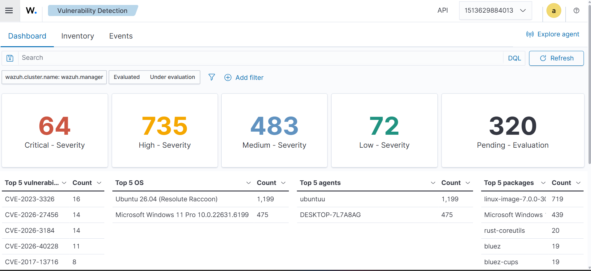
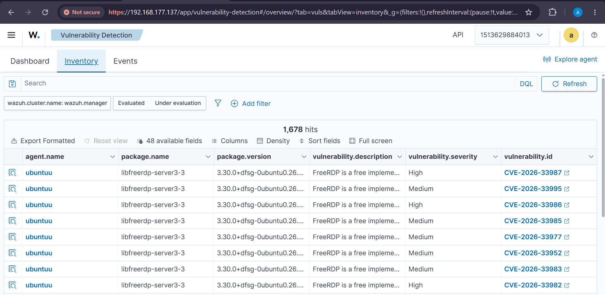

# Lab 1 – Vulnerability Detection

## Objective

Identify security vulnerabilities affecting software packages installed on a monitored Ubuntu endpoint.

## Tools

- Wazuh SIEM
- Ubuntu Linux
- Wazuh Vulnerability Detection

## Investigation

Wazuh identified vulnerabilities associated with installed packages.

Example findings included:

- CVE-2026-33987 – High
- CVE-2026-33995 – Medium
- CVE-2026-33986 – High
- CVE-2026-33985 – Medium

## Evidence

## SOC Skills Demonstrated

- Vulnerability monitoring
- CVE analysis
- Severity assessment
- Security monitoring
- Vulnerability investigation